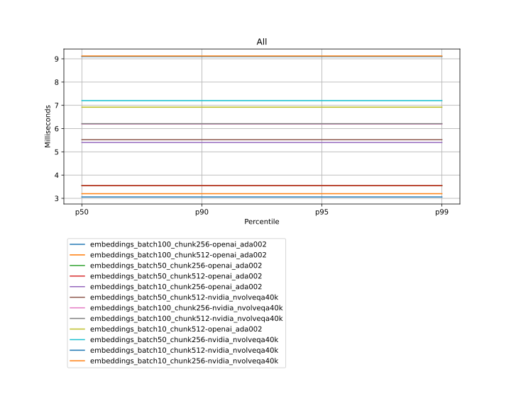

# RAGStack - Benchmarks Report - 2024-01-29 12:07:09

| Test Case | p50 | p90 | p95 | p99 |
|---|---|---|---|---|
| embeddings_batch100_chunk256-openai_ada002 | 3.06 | 3.06 | 3.06 | 3.06 |
| embeddings_batch100_chunk512-openai_ada002 | 3.2 | 3.2 | 3.2 | 3.2 |
| embeddings_batch50_chunk256-openai_ada002 | 3.55 | 3.55 | 3.55 | 3.55 |
| embeddings_batch50_chunk512-openai_ada002 | 3.55 | 3.55 | 3.55 | 3.55 |
| embeddings_batch10_chunk256-openai_ada002 | 5.4 | 5.4 | 5.4 | 5.4 |
| embeddings_batch50_chunk512-nvidia_nvolveqa40k | 5.52 | 5.52 | 5.52 | 5.52 |
| embeddings_batch100_chunk256-nvidia_nvolveqa40k | 6.2 | 6.2 | 6.2 | 6.2 |
| embeddings_batch100_chunk512-nvidia_nvolveqa40k | 6.21 | 6.21 | 6.21 | 6.21 |
| embeddings_batch10_chunk512-openai_ada002 | 6.92 | 6.92 | 6.92 | 6.92 |
| embeddings_batch50_chunk256-nvidia_nvolveqa40k | 7.2 | 7.2 | 7.2 | 7.2 |
| embeddings_batch10_chunk512-nvidia_nvolveqa40k | 9.1 | 9.1 | 9.1 | 9.1 |
| embeddings_batch10_chunk256-nvidia_nvolveqa40k | 9.12 | 9.12 | 9.12 | 9.12 |

