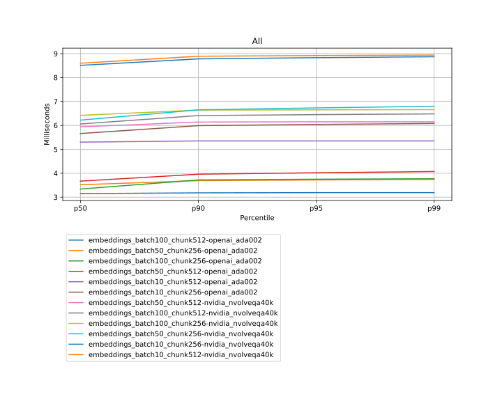

# RAGStack - Benchmarks Report - 2024-01-29 13:09:45

| Test Case | p50 | p90 | p95 | p99 |
|---|---|---|---|---|
| embeddings_batch100_chunk512-openai_ada002 | 3.15 | 3.18 | 3.19 | 3.19 |
| embeddings_batch50_chunk256-openai_ada002 | 3.52 | 3.69 | 3.72 | 3.74 |
| embeddings_batch100_chunk256-openai_ada002 | 3.34 | 3.72 | 3.75 | 3.77 |
| embeddings_batch50_chunk512-openai_ada002 | 3.67 | 3.96 | 4.02 | 4.07 |
| embeddings_batch10_chunk512-openai_ada002 | 5.3 | 5.35 | 5.35 | 5.35 |
| embeddings_batch10_chunk256-openai_ada002 | 5.66 | 5.99 | 6.04 | 6.08 |
| embeddings_batch50_chunk512-nvidia_nvolveqa40k | 5.94 | 6.14 | 6.15 | 6.15 |
| embeddings_batch100_chunk512-nvidia_nvolveqa40k | 6.06 | 6.41 | 6.45 | 6.48 |
| embeddings_batch100_chunk256-nvidia_nvolveqa40k | 6.42 | 6.64 | 6.65 | 6.66 |
| embeddings_batch50_chunk256-nvidia_nvolveqa40k | 6.22 | 6.65 | 6.73 | 6.8 |
| embeddings_batch10_chunk256-nvidia_nvolveqa40k | 8.51 | 8.78 | 8.83 | 8.87 |
| embeddings_batch10_chunk512-nvidia_nvolveqa40k | 8.6 | 8.89 | 8.92 | 8.94 |

